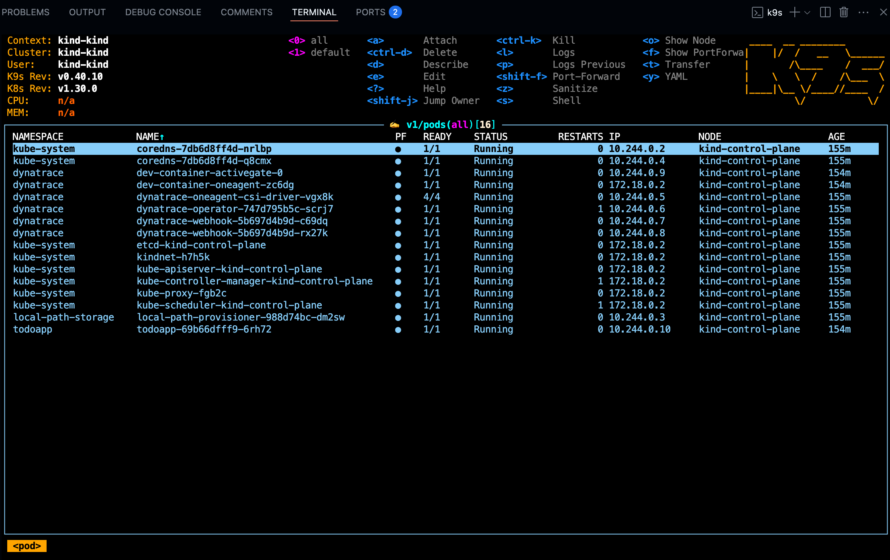

<!-- markdownlint-disable-next-line -->
#  Kubernetes 101

___

Introduction to Kubernetes fundamentals with Dynatrace. Learn core concepts — pods, deployments, services — and observe a live cluster with full-stack monitoring.

## [🚀 Open the lab](https://dynatrace-wwse.github.io/enablement-kubernetes-101)

