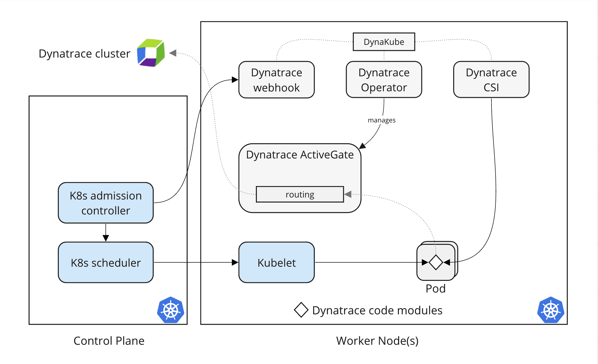

<!-- The step below reads the environment variables and parses them to generate the API for the tenant,
 this way the dynakube is generated (default is the AppOnly one with Log ingest. Those are functions of the framework. -->

<!-- STEP_SETUP
commands:
  - dynatraceEvalReadSaveCredentials && generateDynakube
-->

# Section 2 — Deploy the DynaKube

The **DynaKube** is a Kubernetes Custom Resource that tells the Dynatrace Operator *how* to instrument your cluster — which tenant to connect to, which components to deploy, and how to configure them. Without a DynaKube, the operator is installed but idle.

## How it works

The [**DynaKube**](https://docs.dynatrace.com/docs/ingest-from/setup-on-k8s/reference/dynakube-parameters) custom resource is the single source of truth for how Dynatrace monitors your cluster. It tells the operator which [monitoring mode](https://docs.dynatrace.com/docs/ingest-from/setup-on-k8s/guides/operation/configuration) to use, which tenant to connect to, and which optional components to enable.

### When you deploy the DynaKube with Application Observability in this scenario

- **[ActiveGate](https://docs.dynatrace.com/docs/ingest-from/dynatrace-activegate)** — routes observability data from your cluster to the Dynatrace tenant, acting as a secure proxy.
- **[Code Modules](https://docs.dynatrace.com/docs/ingest-from/setup-on-k8s/guides/operation/configuration/application-only)** — injected into your application pods via the CSI driver to enable deep code-level monitoring and observability.
- **[OpenTelemetry Collector](https://docs.dynatrace.com/docs/ingest-from/opentelemetry/collector/configuration)** — deployed to collect and forward OpenTelemetry signals (traces, metrics, logs) to Dynatrace.
- **[Log Monitoring Module](https://docs.dynatrace.com/docs/ingest-from/setup-on-k8s/deployment/k8s-log-monitoring)** — deployed to capture and ingest container and application logs.





## Step 1 — Open the Dynatrace UI

Normally you would navigate to:

**Infrastructure → Kubernetes → Connect cluster**

Click **Connect cluster** and follow the wizard. Dynatrace will generate two manifests:

1. A `Secret` containing your tenant URL, operator token, and ingest token
2. A `DynaKube` CR with the recommended configuration for your cluster

But since this is a managed environment, we have everything prepared for you. Just deploy the generated dynakube.yaml file in your cluster.

## Step 2 — Apply the generated manifests

Copy the `kubectl apply` command and run it in the Terminal:

```bash

kubectl apply -f /workspaces/enablement-kubernetes-101/.devcontainer/yaml/gen/dynakube.yaml 
```

!!! tip "Tenant credentials are pre-loaded"
    Your environment already has `DT_ENVIRONMENT`, `DT_OPERATOR_TOKEN`, and `DT_INGEST_TOKEN` set. The Dynatrace wizard will detect your tenant from these variables if you are signed in.

## Step 3 — Wait for ActiveGate and pods

After applying the DynaKube, the operator provisions an ActiveGate pod and the CSI driver. On a single-node cluster, the ActiveGate pod will start first, followed by the CSI components.

```bash
kubectl get pods -n dynatrace --watch
```

Wait until all pods show `Running` before continuing.

## Validation — DynaKube object exists

<!-- LAB_QUESTION
type: shell-verification
question: "Verify the DynaKube custom resource was created"
buttonText: "Check DynaKube"
command: "source .devcontainer/util/source_framework.sh >/dev/null 2>&1 && waitForDynakube"
expect:
  operator: exit-zero
hint: "Apply the manifests from the Dynatrace UI wizard. The check waits up to ~150s for the DynaKube CR to appear in the dynatrace namespace."
explanation: "DynaKube CR is present — the operator will now provision monitoring components."
-->

## Validation — ActiveGate is Running

<!-- LAB_QUESTION
type: shell-verification
question: "Verify the ActiveGate pod is Running in the dynatrace namespace"
buttonText: "Check ActiveGate"
command: "source .devcontainer/util/source_framework.sh >/dev/null 2>&1 && waitForActiveGateReady"
expect:
  operator: exit-zero
hint: "The ActiveGate pod may take 1–2 minutes to start after the DynaKube is applied. The check waits up to ~6 min for it to reach Running."
explanation: "ActiveGate is Running — your cluster is connected to the Dynatrace tenant and data will start flowing."
-->

<!-- LAB_SOLUTION
reveal: |
  The DynaKube manifest is generated for you from your tenant credentials (the
  `STEP_SETUP` on this step ran `dynatraceEvalReadSaveCredentials && generateDynakube`).
  Apply it with `kubectl apply -f .devcontainer/yaml/gen/dynakube.yaml`. The framework
  helper `deployApplicationMonitoring` generates and applies the AppOnly + log-ingest
  DynaKube in one step — the "Run solution" button runs it and confirms the DynaKube CR exists.
commands:
  - deployApplicationMonitoring
verify:
  - kubectl get dynakube -n dynatrace --no-headers 2>/dev/null | grep -q .
-->

## Explore your cluster in Dynatrace

Once the ActiveGate is running, your cluster is visible in the Dynatrace Kubernetes app. Open it to see live cluster topology, node health, and workload status.

[dt-app|dynatrace.kubernetes|Open Kubernetes App](placeholder)
