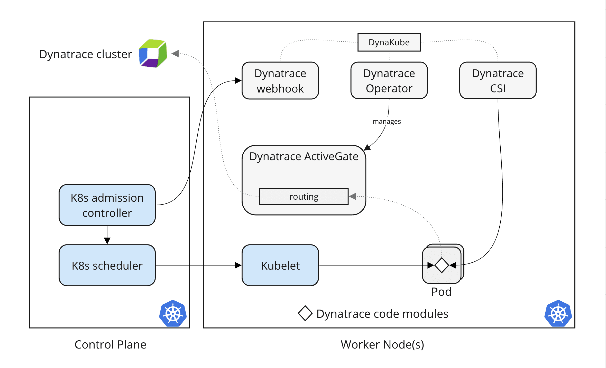
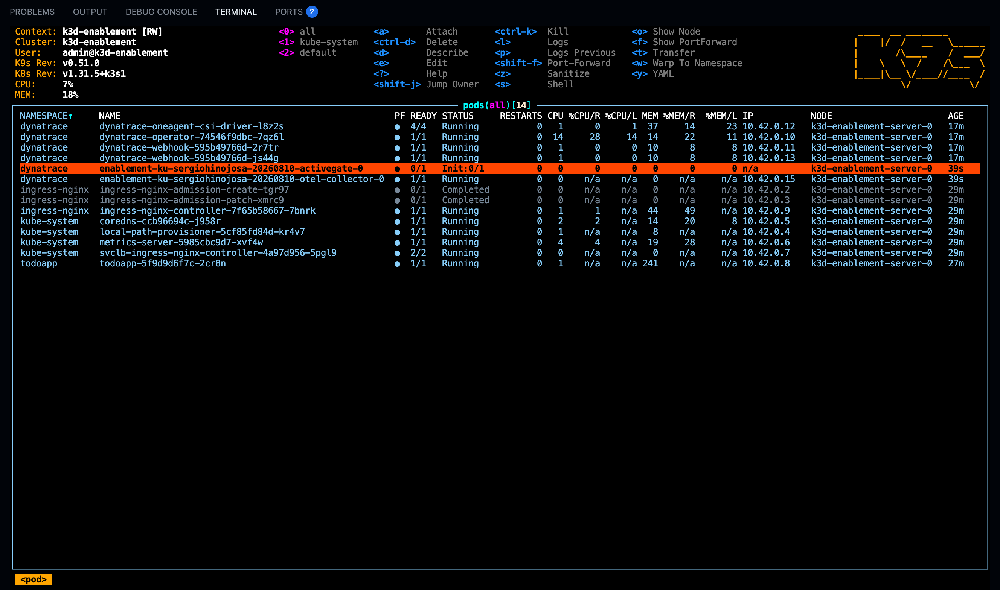

<!-- The step below reads the environment variables and parses them to generate the API for the tenant,
 this way the dynakube is generated (default is the AppOnly one with Log ingest. Those are functions of the framework. -->

<!-- STEP_SETUP
commands:
  - dynatraceEvalReadSaveCredentials && generateDynakube
-->

# Section 2 — Deploy the DynaKube

The **DynaKube** is a Kubernetes Custom Resource that tells the Dynatrace Operator *how* to instrument your cluster — which tenant to connect to, which components to deploy, and how to configure them. Without a DynaKube, the operator is installed but idle.

## How it works

The [**DynaKube**](https://docs.dynatrace.com/docs/ingest-from/setup-on-k8s/reference/dynakube-parameters) custom resource is the single source of truth for how Dynatrace monitors your cluster. It tells the operator which [monitoring mode](https://docs.dynatrace.com/docs/ingest-from/setup-on-k8s/guides/operation/configuration) to use, which tenant to connect to, and which optional components to enable.

### When you deploy the DynaKube with Application Observability in this scenario

- **[ActiveGate](https://docs.dynatrace.com/docs/ingest-from/dynatrace-activegate)** — routes observability data from your cluster to the Dynatrace tenant, acting as a secure proxy.
- **[Code Modules](https://docs.dynatrace.com/docs/ingest-from/setup-on-k8s/guides/operation/configuration/application-only)** — injected into your application pods via the CSI driver to enable deep code-level monitoring and observability.
- **[OpenTelemetry Collector](https://docs.dynatrace.com/docs/ingest-from/opentelemetry/collector/configuration)** — deployed to collect and forward OpenTelemetry signals (traces, metrics, logs) to Dynatrace.
- **[Log Monitoring Module](https://docs.dynatrace.com/docs/ingest-from/setup-on-k8s/deployment/k8s-log-monitoring)** — deployed to capture and ingest container and application logs.





## Step 1 — Open the Dynatrace UI

Normally you would navigate to:

**Infrastructure → Kubernetes → Connect cluster**

Click **Connect cluster** and follow the wizard. Dynatrace will generate two manifests:

1. A `Secret` containing your tenant URL, operator token, and ingest token
2. A `DynaKube` CR with the recommended configuration for your cluster

But since this is a managed environment, we have everything prepared for you. Just deploy the generated dynakube.yaml file in your cluster.

## Step 2 — Apply the generated manifests

Copy the `kubectl apply` command and run it in the Terminal:

```bash

kubectl apply -f /workspaces/enablement-kubernetes-101/.devcontainer/yaml/gen/dynakube.yaml 
```

!!! tip "Tenant credentials are pre-loaded"
    Your environment already has `DT_ENVIRONMENT`, `DT_OPERATOR_TOKEN`, and `DT_INGEST_TOKEN` set. The Dynatrace wizard will detect your tenant from these variables if you are signed in.

## Step 3 — Wait for ActiveGate and pods

After applying the DynaKube, the operator provisions an ActiveGate pod and the CSI driver. On a single-node cluster, the ActiveGate pod will start first, followed by the CSI components.

```bash
kubectl get pods -n dynatrace --watch
```

Wait until all pods show `Running` before continuing.

??? tip "Watch with K9S"
    [K9S](https://k9scli.io/) is a terminal-based Kubernetes UI that lets you watch and manage your Kubernetes clusters with style. Launch it with `k9s`, then navigate to the `dynatrace` namespace to see the dynatrace components updating live.

    | Action | Command / Shortcut |
    |---|---|
    | Launch K9S | `k9s` |
    | List pods in a namespace | `:pods` → type namespace filter, e.g. `dynatrace` |
    | List all namespaces | `:namespaces` |
    | View DynaKube custom resource | `:dynakube` → select the resource to inspect it |
    | Describe a deployment | `:deployments` → select one → press `d` |
    | Shell into a container | Select a pod → press `s` |
    | Quit | `:q` or `Ctrl+C` |

    

## Validation — DynaKube object exists

<!-- LAB_QUESTION
type: shell-verification
question: "Verify the DynaKube custom resource was created"
buttonText: "Check DynaKube"
command: "source .devcontainer/util/source_framework.sh >/dev/null 2>&1 && checkDynakube"
expect:
  operator: exit-zero
hint: "Apply the manifests from the Dynatrace UI wizard, then check again — the check looks for the DynaKube CR in the dynatrace namespace."
explanation: "DynaKube CR is present — the operator will now provision monitoring components."
-->

## Validation — ActiveGate is Running

<!-- LAB_QUESTION
type: shell-verification
question: "Verify the ActiveGate pod is Running in the dynatrace namespace"
buttonText: "Check ActiveGate"
command: "source .devcontainer/util/source_framework.sh >/dev/null 2>&1 && checkActiveGateReady"
expect:
  operator: exit-zero
hint: "The ActiveGate pod may take 1–2 minutes to start after the DynaKube is applied. Watch `kubectl get pods -n dynatrace` and check again once it is Running."
explanation: "ActiveGate is Running — your cluster is connected to the Dynatrace tenant and data will start flowing."
-->

## Your cluster is already capturing logs

Here is the part people expect to be harder than it is: **there is nothing left for you to do.**

The DynaKube you just applied enables the [Log Monitoring module](https://docs.dynatrace.com/docs/ingest-from/setup-on-k8s/deployment/k8s-log-monitoring). The operator rolls out a log monitoring DaemonSet — its pods are named after your DynaKube, ending in `-logmonitoring` — one pod per node, and that pod tails the standard output of **every container on the node** straight from the node's log files.

That means log collection needs:

- **no application restart** — the log module reads files the container runtime already writes;
- **no code injection** — it never touches your application process;
- **no change to your application** — no logging library, no sidecar, no log driver.

This is worth pausing on, because the *next* section is different: traces **do** require a restart, because the agent has to be injected into the process at startup. Logs come from outside the process; traces come from inside it.

### Validation — the log module is running

<!-- LAB_QUESTION
type: shell-verification
question: "Verify the Dynatrace log module is running on your cluster"
buttonText: "Check log module"
command: "source .devcontainer/util/source_framework.sh >/dev/null 2>&1 && checkLogModuleReady"
expect:
  operator: exit-zero
hint: "The log module DaemonSet is rolled out by the operator a few moments after the DynaKube is applied. Watch `kubectl get pods -n dynatrace` and check again once a `logmonitoring` pod is Running."
explanation: "The log module is Running — every container's stdout on this node is now being shipped to Dynatrace."
-->

### Validation — logs are arriving in Grail

The `todoapp` has been running since your environment started, and has never been restarted or instrumented — so any log line it produces is proof that the log module alone is doing the work.

The `endsWith(k8s.cluster.name, "{{DT_SESSION_ID}}")` filter scopes the query to **your** cluster. Every session gets a unique cluster identity ending in your session id, so classmates running this training against the same tenant never pollute your results.

The query below counts the log lines collected from your cluster in the last 30 minutes, grouped by namespace and log level. The result is a small table that proves something bigger than "logs arrive": **every namespace on the cluster is shipping logs** — the demo app, the Dynatrace components, the system namespaces — all without touching a single one of them.

```dql
fetch logs, from:now()-30m
| filter endsWith(k8s.cluster.name, "{{DT_SESSION_ID}}")
| summarize count = count(), by: {namespace = k8s.namespace.name, level = loglevel}
| sort namespace asc, count desc
```

!!! tip "Why `endsWith` and not `==`"
    Your cluster is named after the training plus your session id, but Kubernetes caps how long that name can be — so the *training* half gets truncated while your session id stays intact at the end. `endsWith` matches the part that is guaranteed to survive.

<!-- LAB_QUESTION
type: dql-verification
question: "Verify your cluster's container logs are reaching Dynatrace Grail"
buttonText: "Check logs in Grail"
dql: |
  fetch logs, from:now()-15m
  | filter endsWith(k8s.cluster.name, "{{DT_SESSION_ID}}")
  | limit 1
expect:
  operator: not-empty
hint: "The log module needs to be Running first (previous check), and logs take ~1–2 minutes to reach Grail. Wait a moment and check again."
explanation: "Logs from your cluster are in Grail — captured with no restart, no injection and no application change."
-->

<!-- LAB_SOLUTION
reveal: |
  The DynaKube manifest is generated for you from your tenant credentials (the
  `STEP_SETUP` on this step ran `dynatraceEvalReadSaveCredentials && generateDynakube`).
  Apply it with `kubectl apply -f .devcontainer/yaml/gen/dynakube.yaml`. The framework
  helper `deployApplicationMonitoring` generates and applies the AppOnly + log-ingest
  DynaKube in one step — the "Run solution" button runs it and confirms the DynaKube CR exists.
commands:
  - deployApplicationMonitoring
  - fixSprintCodeModulesImage
verify:
  - kubectl get dynakube -n dynatrace --no-headers 2>/dev/null | grep -q .
-->

## Explore your cluster in Dynatrace

Once the ActiveGate is running, your cluster is visible in the Dynatrace Kubernetes app. Open it to see live cluster topology, node health, and workload status.

[dt-app|dynatrace.kubernetes|Open Kubernetes App](placeholder)
