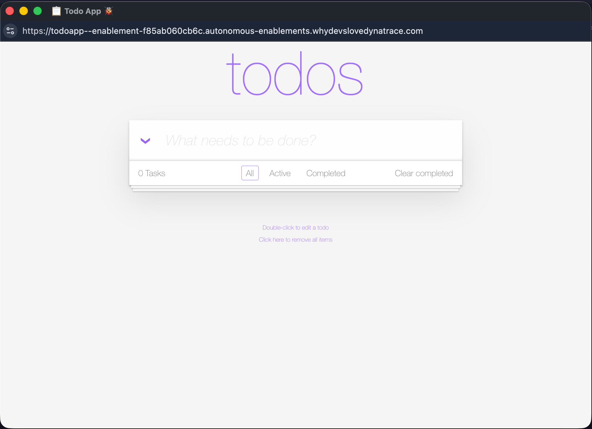

# Prerequisites

Before deploying the Dynatrace Operator, confirm that your Kubernetes cluster is ready and the demo application is running. Use the checks below — both must pass before you continue.

## 1. Cluster node is Ready

Your environment runs a single-node k3d cluster. The node must be in `Ready` state.

```bash
kubectl get nodes
```

Expected output: one node with status `Ready`.

<!-- LAB_QUESTION
type: shell-verification
question: "Verify the cluster node is Ready"
buttonText: "Check Cluster"
command: "kubectl get nodes --no-headers 2>/dev/null | grep -c ' Ready'"
expect:
  operator: gt
  value: 0
hint: "The cluster is provisioned automatically. Wait 30 seconds and try again if it is not ready yet."
explanation: "Cluster node is Ready — you are good to proceed."
-->

## 2. Demo application is running

The TODO application should already be deployed in the `todoapp` namespace by the environment setup script.

### 2.1 Verify in the terminal

On the navigation bar, above you'll find a button to start a new shell and connect to the training environment. Open it and type the following command:

```bash
kubectl get pods -n todoapp
```

Expected output: one or more pods with status `Running`.

### 2.1 Verify in the browser

You can open the app in the navigation tab "Apps". Once it's registered you'll be able to open the app so you can interact with it.


 


<!-- LAB_QUESTION
type: shell-verification
question: "Verify the TODO application pods are Running"
buttonText: "Check Application"
command: "kubectl get pods -n todoapp --no-headers 2>/dev/null | grep -c Running"
expect:
  operator: gt
  value: 0
hint: "The application is deployed automatically. If no pods are running, check the environment log for errors."
explanation: "TODO application pods are Running — your environment is ready."
-->

!!! success "Both checks passed?"
    Continue to **Section 1: Deploy the Operator**.
