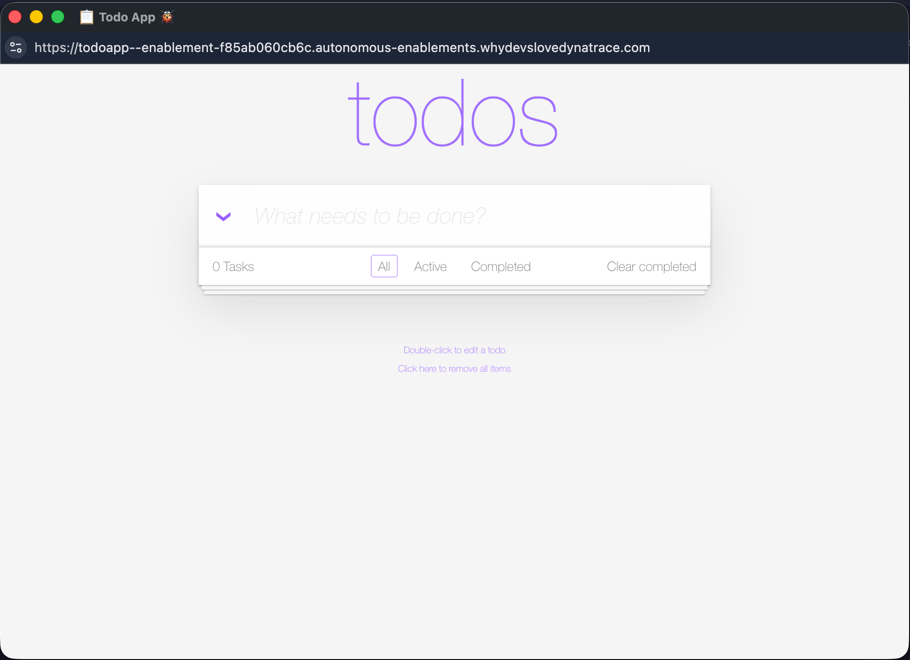

<!-- LAB_NO_SOLUTION: Provisioning sanity checks (cluster node Ready, demo app running) — the environment provides these, there is nothing for the learner to solve. -->


# Prerequisites

Before deploying the Dynatrace Operator, confirm that your Kubernetes cluster is ready and the demo application is running. Use the checks below — both must pass before you continue.

## 1. Cluster node is Ready

Your environment runs a single-node k3d cluster. The node must be in `Ready` state.

```bash
kubectl get nodes
```

Expected output: one node with status `Ready`.

<!-- LAB_QUESTION
type: shell-verification
question: "Verify the cluster node is Ready"
buttonText: "Check Cluster"
command: "source .devcontainer/util/source_framework.sh >/dev/null 2>&1 && checkNodeReady"
expect:
  operator: exit-zero
hint: "The cluster is provisioned automatically at startup. If the node is not Ready yet, wait a moment and check again."
explanation: "Cluster node is Ready — you are good to proceed."
-->

## 2. Demo application is running

The TODO application should already be deployed in the `todoapp` namespace by the environment setup script.

### 2.1 Verify in the terminal

In the workspace toolbar you'll find a button that opens a new shell connected to your training environment. Open it and type the following command:

```bash
kubectl get pods -n todoapp
```

Expected output: one or more pods with status `Running`.

### 2.2 Verify in the browser

The workspace also lists the applications running in your environment. Once the Todo app registers, an **Open App** button appears — use it to open the app in a new tab and interact with it.


 


<!-- LAB_QUESTION
type: shell-verification
question: "Verify the TODO application pods are Running"
buttonText: "Check Application"
command: "source .devcontainer/util/source_framework.sh >/dev/null 2>&1 && checkTodoAppRunning"
expect:
  operator: exit-zero
hint: "The application is deployed automatically. If the todoapp pods are not Running yet, wait a moment and check again."
explanation: "TODO application pods are Running — your environment is ready."
-->

!!! success "Both checks passed?"
    Continue to **Section 1: Deploy the Operator**.
